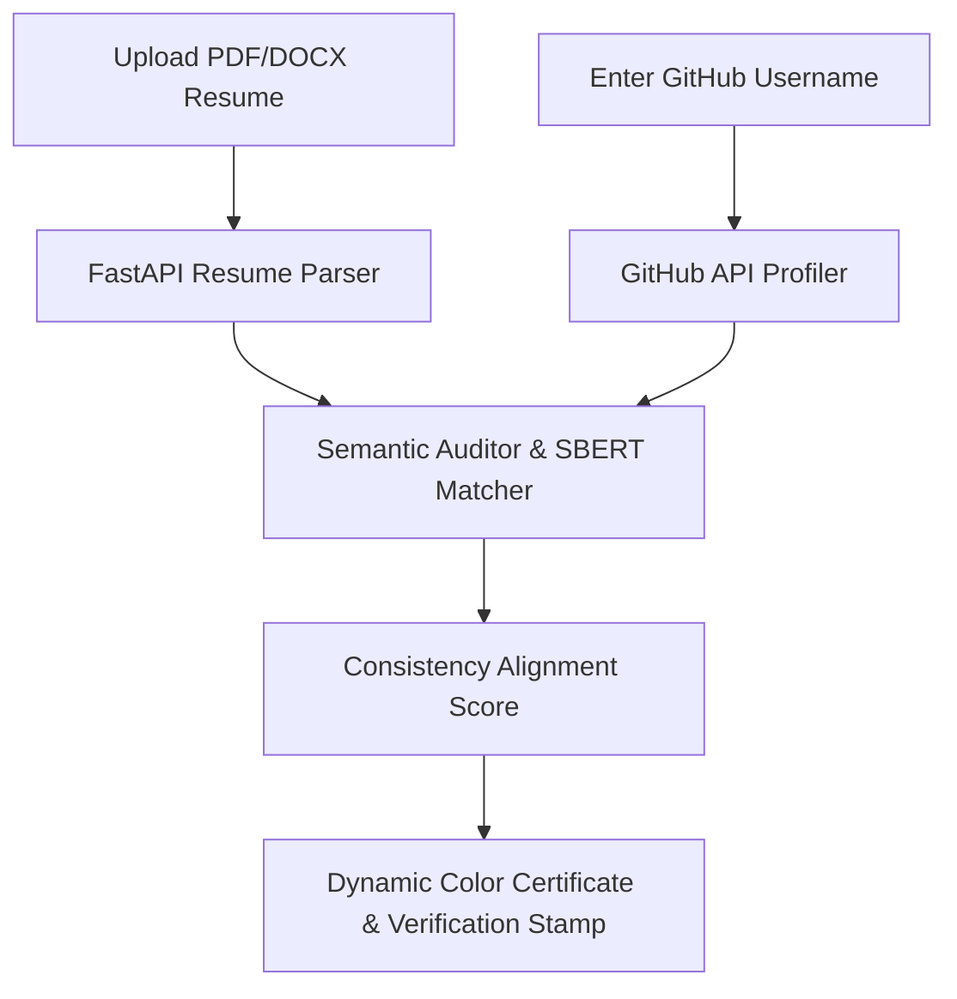

# 🛡️ GitVeritas — Resume vs GitHub Consistency Auditor

<div align="center">
  
  [](LICENSE)
  [](https://fastapi.tiangolo.com)
  [](https://javascript.info)
  
  **GitVeritas** is an automated, AI-powered developer credential verification platform. It cross-checks candidates' resumes against their actual GitHub contributions, generating verified credibility certificates for recruiters.
  
</div>

---

## 🌟 Key Features

* **📄 Intelligent Resume Parsing**: Extracts core technologies, libraries, and claimed repositories from PDF and DOCX resumes.
* **🐙 Deep GitHub Profiling**: Scrapes repositories, collaborative Pull Requests, contributions, and active languages directly from the GitHub API.
* **🔍 AI Consistency Auditing**: Utilizes Sentence-Transformers (SBERT) to evaluate semantical matching between claims made on a resume and code contributions pushed to GitHub.
* **conic Conic Pie Match Indicator**: Visualizes alignment scores dynamically on the user dashboard.
* **🛡️ Dynamic Verified Stamp (Seals)**: Generates printable, high-contrast credibility certificates in 4 dynamic color stages:
  * 🥇 **Gold Certified ($\ge$ 85%)**: High-alignment master contributor.
  * 🥈 **Silver Certified ($\ge$ 70%)**: Consistent, verified code contributor.
  * 🥉 **Bronze Certified ($\ge$ 40%)**: Verified foundational capabilities.
  * 🟢 **Green Certified (< 40%)**: Audited baseline alignment.

---

## 🔮 System Architecture



---

## ⚡ Setup & Installation

The project includes an automated PowerShell script to install dependencies and run the server with a single command.

### Quick Start
1. Clone the repository:
   ```bash
   git clone https://github.com/preetikaanjana/GitVeritas.git
   cd GitVeritas
   ```

2. Run the startup script:
   ```powershell
   .\run.ps1
   ```
   *The script will automatically set up your Python virtual environment, install packages from `requirements.txt`, and start the hot-reloading FastAPI uvicorn server on `http://127.0.0.1:8000`.*

---

## 🛠️ Technology Stack

| Component | Technology | Role |
| :--- | :--- | :--- |
| **Backend** | Python, FastAPI, Uvicorn | High-performance RESTful API endpoints |
| **Parsing** | PyPDF, python-docx | Text extraction from multi-format resume files |
| **AI Auditing** | Sentence-Transformers (SBERT) | Semantic similarity comparison of project claims |
| **Frontend** | HTML5, Vanilla CSS, Javascript | Premium dark-themed user dashboard & printable certificate cards |
