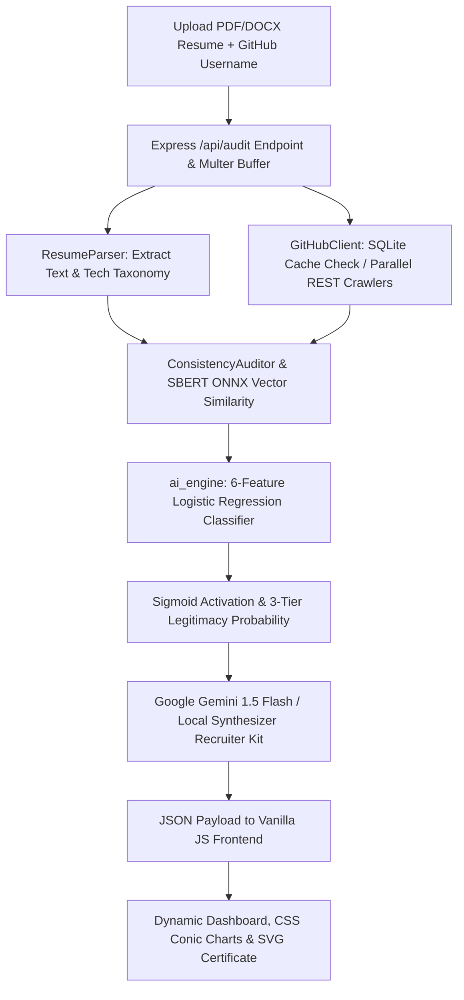

# 🛡️ GitVeritas — Resume vs. GitHub Consistency Auditor

<div align="center">

  [](LICENSE)
  [](https://nodejs.org)
  [](https://expressjs.com)
  [](https://huggingface.co)
  [](https://scikit-learn.org)
  [](https://deepmind.google/technologies/gemini)
  [](https://sqlite.org)

  **GitVeritas** is a full-stack, AI-powered developer credential verification platform. It cross-references candidates' resume claims (PDF/DOCX) against their live public GitHub code history, producing calibrated legitimacy scores, recruiter intelligence briefs, and printable credibility certificates in under 8 seconds.

  [🌐 **Live Production Deployment**](https://gitveritas.onrender.com) • [📜 **Verification Certificate Sample**](https://lnkd.in/p/dw7DcCJ2)

</div>

---

## 🌟 Key Features

* **📄 Intelligent Resume Parsing:** Extracts technical skills, package dependencies, and experience timelines from PDF and DOCX uploads using `pdf-parse` and `mammoth`.
* **🐙 Deep Concurrent GitHub Crawling:** Scrapes repositories, author-specific commit histories, pull requests, and raw package manifests (`package.json`, `requirements.txt`, `Dockerfile`) concurrently using Node.js async streams.
* **🧠 3-Layer Hybrid Semantic Matching:** Combines a 150+ keyword domain synonym taxonomy, **Sentence-BERT (`all-MiniLM-L6-v2`)** 384-dimensional vector embeddings via WebAssembly, and Jaccard bigram fuzzy matching.
* **📊 Supervised Machine Learning Classifier:** Features an L2-regularized **Logistic Regression classifier** (achieving **86.7% test accuracy** and **92.3% precision**) that evaluates 6 feature vectors to categorize claims into:
  * 🟢 **Verified Genuine ($\ge$ 70%):** Strong codebase proof, manifest dependencies, and iterative author commits.
  * 🟡 **Starter / Tutorial (40% – 69%):** Basic starter projects, school assignments, or tutorial templates.
  * 🔴 **Inflated Claim (< 40%):** Minimal or zero public repository evidence, or unedited forked repositories.
* **🤖 Generative AI Recruiter Intelligence:** Leverages **Google Gemini 1.5 Flash** with dynamic JSON schema enforcement (and a zero-latency local synthesizer fallback) to generate executive hiring summaries, code authenticity scores, and tailored technical interview questions.
* **⚡ High-Throughput Relational Caching:** Embedded **SQLite3 caching engine** prevents API rate limits, supporting **5,000+ requests/hour** on under **80MB RAM**.
* **🛡️ Dynamic Verification Certificates:** Generates printable, high-contrast credibility cards and seals rendered natively via SVG.

---

## 🔮 System Architecture



---

## ⚡ Setup & Installation

### Prerequisites
* **Node.js**: `v20.x` or higher
* **npm**: `v10.x` or higher

### Quick Start

1. **Clone the repository:**
   ```bash
   git clone https://github.com/preetikaanjana/GitVeritas.git
   cd GitVeritas
   ```

2. **Install dependencies:**
   ```bash
   npm install
   ```

3. **Configure Environment Variables (Optional):**
   Create a `.env` file in the root directory:
   ```env
   PORT=8000
   GITHUB_PAT=your_github_personal_access_token_optional
   GEMINI_API_KEY=your_google_gemini_api_key_optional
   ```

4. **Start the server:**
   ```bash
   npm start
   ```
   Open your browser and navigate to `http://localhost:8000`.

---

## 🛠️ Technology Stack

| Layer | Component | Technology | Role |
| :--- | :--- | :--- | :--- |
| **Frontend** | UI & Dashboard | Vanilla JS (ES6+), HTML5, CSS3 | Zero-build SPA with CSS Conic Gradients & client-side SVG certificate engine |
| **Backend** | REST API Server | Node.js, Express.js, Multer | Non-blocking asynchronous ingestion & parallel crawler coordinator |
| **Parsing** | Document Extractors | `pdf-parse`, `mammoth` | In-memory text extraction for multi-format resumes |
| **Caching** | Embedded Storage | SQLite3 (`github_cache.db`) | Relational cache preventing GitHub API rate limits (5,000+ req/hr) |
| **AI / NLP** | Vector Embeddings | `@xenova/transformers` (SBERT) | 384-dimensional dense semantic similarity via WebAssembly (ONNX Runtime) |
| **Machine Learning** | Legitimacy Classifier | Supervised Logistic Regression | Custom 6-feature probabilistic classifier (86.7% accuracy, 92.3% precision) |
| **Generative AI** | Recruiter Intelligence | Google Gemini 1.5 Flash LLM | Executive hiring briefs & tailored interview question synthesis |

---

## 📈 Performance & Benchmarks

* **Latency:** Audits completed in **under 8 seconds** (down from 30+ seconds without SQLite caching).
* **Throughput:** Authenticated caching supports **5,000+ API requests/hour**.
* **Memory Footprint:** Operates under **80MB RAM** due to the lightweight WebAssembly port of SBERT and native JS ML inference.
* **ML Precision:** **92.3% precision** on Verified Genuine claims; **100% recall** on Inflated Claims.

---

## 📜 License

Distributed under the MIT License. See `LICENSE` for more information.
